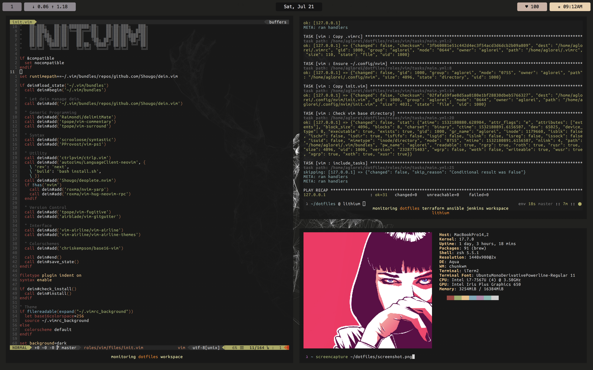

# Dotfiles



## Purpose

This repository uses [ansible](https://github.com/ansible/ansible) to install dotfiles and maintain package installations using OS managers. Currently, the default dotfiles configurations and package manifests are my own, and exist for MacOSX and Arch Linux. My sensitive vars files are separated by inventory group and encrypted with [ansible-vault](https://docs.ansible.com/ansible/latest/user_guide/vault.html). The entrypoint playbook that specifies the role order is [local.yml](local.yml).

## Vanilla Use

### Ansible Playbook

The inventory groups and roles are written in such a way where specifying `--limit localhost` bypasses the reading of vaulted material, providing for a generic configuration of various tools and OS-specific package installations.

```sh
ansible-playbook --limit localhost local.yml
```

### Ansible Pull

The [local.yml](local.yml) playbook can also be executed using [ansible-pull](https://docs.ansible.com/ansible/latest/user_guide/playbooks_intro.html#ansible-pull) by using the [pull.yml](pull.yml) playbook, which schedules the ansible-pull execution on a cron schedule, allowing for the upstream changes to propogate to the host in an eventually consistent manner.

```sh
ansible-playbook --limit localhost pull.yml
```

## Vanilla Configurations

### Mac

* Creates a link to [Brewfile](roles/packages/files/Brewfile) in $HOME
* Installs [chunkwm](https://github.com/koekeishiya/chunkwm)
* Installs [skhd](https://github.com/koekeishiya/skhd)

### Utilities

* Creates a link to [gpg-agent.conf](roles/utils/templates/gpg-agent.conf.j2) in $HOME/.gnupg/gpg-agent.conf
* Creates a link to [htoprc](utils/roles/utils/files/htoprc) in $HOME/.config/htoprc
* Creates a link to [tmux.conf](roles/utils/files/tmux.conf) in $HOME

### Shell
* Installs [base16-shell](https://github.com/chriskempson/base16-shell)
* Installs [fast-syntax-highlighting](https://github.com/zdharma/fast-syntax-highlighting)
* Installs [geometry](https://github.com/geometry-zsh/geometry)
* Installs [oh-my-zsh](https://github.com/robbyrussell/oh-my-zsh)
* Creates a link to [zshrc](roles/utils/templates/zshrc.j2) in $HOME

### Vim

* Installs [dein.vim](https://github.com/Shougo/dein) plugin manager
* Creates a link to [vimrc](roles/vim/files/vimrc) in $HOME
* Creates a link to [init.vim](roles/vim/files/init.vim) in $HOME/.config/nvim
